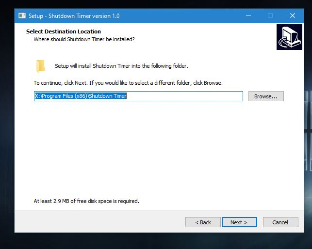

# timer-shutdown
## shutdown timer gui

This application functions as a computer shutdown timer on Windows based operating systems. 
This application can be used for your personal computer, especially the computer used by your child so that your child does not over time play games on the computer 

# How to Use this Application
first of all you install this shutdown application on your computer in the following way:

1. Download the file https://github.com/fajarjulyana/timer-shutdown/blob/main/setup/shutdown-timerv1.0_setup.exe
2. Run shutdown-timerv1.0_setup.exe
3. Press the Next Button
    
4. Select the storage location you want or immediately press the Next button
    
6. If you want to add a shortcut on the desktop, tick the desktop shortcut, if it's not slim, press the Next button
    
7. Check whether the installation location is according to your wishes after pressing the install button accordingly
    
8. If you want to run the application immediately, check the launch shutdown timer, if not, uncheck and press finish, the installation is complete
 

Here are the steps for using the Shutdown Timer application:

1. Run the Shutdown Timer application.
2. In the "Delay Time" input box, enter the amount of time delayed in seconds.
3. Check the "Start at Startup" box if you want the application to automatically start on Windows startup.
4. Click the "Start Shutdown" button.
5. A confirmation message will appear that the shutdown will begin.
6. Wait until the delayed time is over, and the computer will shutdown.
7. If you want to close the application before the time is up, click the "X" button on the application window or press Alt+F4.
8. If you want to cancel the shutdown, press the "Ctrl+Alt+Delete" key and select the option to cancel the shutdown.

Apart from that, there is also an “About” menu which you can access from the application menu. The "About" menu will display information about the Shutdown Timer application, including its version and creator.

If you enable the "Start at Startup" option, the application will automatically start every time you turn on your computer.

These are the steps for using the Shutdown Timer application.
# Source Code
this is main.cpp code you can build this
https://github.com/fajarjulyana/timer-shutdown/blob/6bd89eb621bd73a3df15129a6bf9db52f2bd82a2/src/main.cpp#L1-L179
# Documentation
